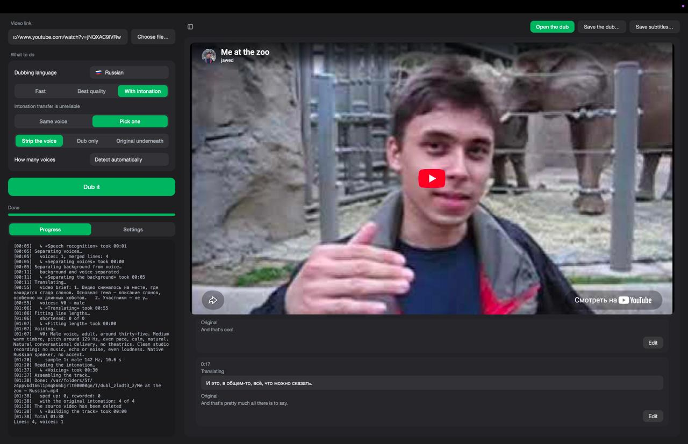
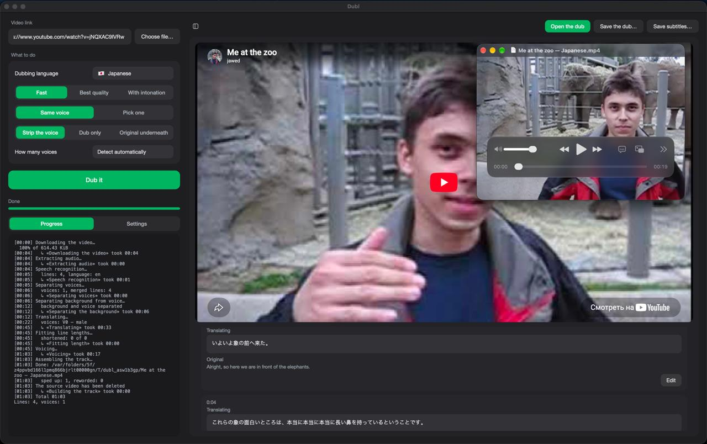

# Dubl

Dubs a video into another language, entirely on your Mac.

[Русский](#dubl-1)



## Download

**[Dubl.dmg](https://github.com/Drtonix/Dubl/releases/latest/download/Dubl.dmg)**

First launch goes through right-click → **Open** → **Open**. Then download
the models in Settings.

## Requirements

Apple Silicon, macOS 14 or newer. Intel Macs are not supported.

| Model | Size | RAM |
|---|---|---|
| Qwen3-30B-A3B, 4-bit — Fast | 16 GB | 32 GB |
| Qwen3-32B, 4-bit — Best quality | 17 GB | 32 GB |
| Whisper large-v3 | 2.9 GB | — |
| Qwen3-TTS, Base and VoiceDesign | 8.4 GB | — |
| HTDemucs | 0.1 GB | — |

Everything is downloaded from the Settings tab and lives in the shared Hugging
Face cache, so it survives updates. Nothing else needs to be installed.

## Measured

Test machine: MacBook Pro, M4 Max (14-core CPU, 410 GB/s memory bandwidth),
36 GB, macOS 27. Cold start included.

| Job | Mode | Time |
|---|---|---|
| 19-second clip, one voice | Best quality | 46 s |
| the same clip | With intonation | 54 s |
| 75-second interview, two voices | Fast | 123 s |
| the same interview | Best quality | 220 s |

Translation and synthesis take almost all of it: 99 s and 54 s of that last
run. Both scale with the amount of speech, not with the length of the video —
a talking-head video costs far more per minute than one with music over it.

## Other Macs

Not measured — extrapolated from the numbers above.

| Mac | Fast | Best quality |
|---|---|---|
| M1–M6, 16 GB | does not fit | does not fit |
| M1–M6 Pro, 24 GB | tight, swaps | does not fit |
| M1–M6 Pro, 32–48 GB | works, roughly 1.5–2× slower | works, roughly 2× slower |
| M1–M6 Max / Ultra, 32 GB+ | at or above the times above | at or above the times above |

Memory matters more than generation: the translation model, the speech
synthesiser and the separator all sit in memory at different stages.

## Features

**Languages.** Any language Whisper recognises on the way in. Ten on the way
out: Chinese, English, French, German, Italian, Japanese, Korean,
Portuguese, Russian, Spanish. The source language is detected, not chosen.

**Sources.** Any site yt-dlp handles, or a local file dropped on the window.

**Voices.** Kept from the original by cloning, or picked to match the speaker's
measured pitch and pace. Speakers are separated; their count can be set by
hand.

**Original audio.** Music and effects are separated from the voice and kept
under the dub. Or dropped entirely, or left underneath at low volume.

**Intonation.** The pitch and dynamics of the original are transferred onto
the dub, so the line lands in the same place with the same melody. Works on
singing; unreliable on speech, which is why it is a separate mode.

**Editing.** Every line is shown next to its original and can be rewritten.
One button re-voices the video with the corrections; the transcript,
translation and separated audio are reused, so it takes seconds.

**Subtitles.** Translation and original go into the file as two tracks, and
can be saved as `.srt` separately.

**Interface.** Russian and English.



## Examples

A 19-second clip, dubbed four ways. The files open in GitHub's player.

| File | Language | Voice |
|---|---|---|
| [original.mp4](examples/original.mp4) | English | — |
| [russian.mp4](examples/russian.mp4) | Russian | picked |
| [russian-intonation.mp4](examples/russian-intonation.mp4) | Russian | picked, intonation transferred |
| [japanese-same-voice.mp4](examples/japanese-same-voice.mp4) | Japanese | cloned from the original |
| [chinese.mp4](examples/chinese.mp4) | Chinese | picked |

## Build

```
git clone git@github.com:Drtonix/Dubl.git
cd Dubl
./build_app.sh
```

The first run compiles FFmpeg from source, which takes a while. Output is
`build/Dubl.app`. Speaker weights come from `fetch_models.sh`, which the build
calls. `./make_dmg.sh` packs the installer and needs `pip install dmgbuild`.

To run from source: install `PySide6 mlx-lm mlx-whisper sherpa-onnx soundfile
scipy numpy yt-dlp num2words demucs torch torchaudio pyworld mlx-audio`
into a
virtualenv, run `./fetch_models.sh`, start `python app.py`, keep FFmpeg on
`PATH`.

## Limits

- Intonation transfer is a separate mode because on ordinary speech it often
  sounds worse than the plain dub.
- Lines longer than their gap in the original are shortened by the model, and
  past that sped up; heavy speed-ups are listed in the log.
- A voice that speaks less than 20 seconds, or under 6% of the recording,
  is folded into the nearest speaker.
- Login-gated sites do not work.

## License

MIT, see [LICENSE](LICENSE). Bundled components and model weights are listed in
[THIRD-PARTY.md](THIRD-PARTY.md).

DrTonix · [bdub.space](https://bdub.space)

---

# Dubl

Переводит и озвучивает видео целиком на вашем Mac.

[English](#dubl)


## Установка

**[Dubl.dmg](https://github.com/Drtonix/Dubl/releases/latest/download/Dubl.dmg)**

Первый запуск — через правую кнопку → **Открыть** → **Открыть**. Дальше
скачать модели в настройках.

## Требования

Apple Silicon, macOS 14 или новее. Mac на Intel не поддерживаются.

| Модель | Размер | Память |
|---|---|---|
| Qwen3-30B-A3B, 4 бита — «Быстро» | 16 ГБ | 32 ГБ |
| Qwen3-32B, 4 бита — «Качественно» | 17 ГБ | 32 ГБ |
| Whisper large-v3 | 2,9 ГБ | — |
| Qwen3-TTS, Base и VoiceDesign | 8,4 ГБ | — |
| HTDemucs | 0,1 ГБ | — |

Всё качается на вкладке настроек и лежит в общем кэше Hugging Face, поэтому
переживает обновление приложения. Ставить что-то ещё не нужно.

## Замеры

Тестовая машина: MacBook Pro, M4 Max (14 ядер, пропускная способность памяти
410 ГБ/с), 36 ГБ, macOS 27. С холодного старта.

| Задача | Режим | Время |
|---|---|---|
| ролик 19 секунд, один голос | Качественно | 46 с |
| он же | С интонациями | 54 с |
| интервью 75 секунд, два голоса | Быстро | 123 с |
| оно же | Качественно | 220 с |

Почти всё время уходит на перевод и озвучку: в последнем прогоне 99 и 54
секунды. Оба зависят от количества речи, а не от длины ролика — ролик, где
говорят без пауз, стоит куда дороже минуты с музыкой поверх.

## Другие Mac

Не измерялось — прикидка от чисел выше.

| Mac | Быстро | Качественно |
|---|---|---|
| M1–M6, 16 ГБ | не помещается | не помещается |
| M1–M6 Pro, 24 ГБ | впритык, уходит в подкачку | не помещается |
| M1–M6 Pro, 32–48 ГБ | работает, в 1,5–2 раза дольше | работает, вдвое дольше |
| M1–M6 Max / Ultra, 32 ГБ и выше | как в таблице выше или быстрее | как в таблице выше или быстрее |

Памяти здесь важнее поколения: модель перевода, синтез речи и разделение
дорожек занимают память на разных этапах.

## Возможности

**Языки.** На входе любой, который распознаёт Whisper. На выходе десять:
английский, испанский, итальянский, китайский, корейский, немецкий,
португальский, русский, французский, японский. Язык оригинала определяется
сам, выбирать его не нужно.

**Источники.** Любой сайт, который знает yt-dlp, или файл с диска
перетаскиванием в окно.

**Голоса.** Оригинальный — клонированием, или подобранный под измеренную
высоту тона и темп речи говорящего. Голоса разделяются, число можно задать
вручную.

**Оригинальный звук.** Музыка и эффекты отделяются от голоса и остаются под
дубляжом. Либо убираются совсем, либо оригинал остаётся фоном потише.

**Интонации.** Высота тона и громкость оригинала переносятся на дубляж, и
реплика ложится на то же место с той же мелодией. На песне работает; на
обычной речи бывает хуже обычного дубляжа, поэтому вынесено в отдельный режим.

**Правка.** Каждая реплика показана рядом с оригиналом, текст можно переписать.
Кнопка переозвучивает ролик с исправлениями: расшифровка, перевод и
разделённые дорожки берутся готовыми, поэтому это занимает секунды.

**Субтитры.** Перевод и оригинал кладутся в файл двумя дорожками и отдельно
сохраняются в `.srt`.

**Интерфейс.** Русский и английский.


## Примеры

Ролик на 19 секунд, озвученный четырьмя способами. Файлы открываются
во встроенном проигрывателе GitHub.

| Файл | Язык | Голос |
|---|---|---|
| [original.mp4](examples/original.mp4) | английский | — |
| [russian.mp4](examples/russian.mp4) | русский | подобранный |
| [russian-intonation.mp4](examples/russian-intonation.mp4) | русский | подобранный, с переносом интонации |
| [japanese-same-voice.mp4](examples/japanese-same-voice.mp4) | японский | как в оригинале |
| [chinese.mp4](examples/chinese.mp4) | китайский | подобранный |

## Сборка

```
git clone git@github.com:Drtonix/Dubl.git
cd Dubl
./build_app.sh
```

Первый прогон долгий: ffmpeg собирается из исходников. На выходе
`build/Dubl.app`. Веса разделения голосов качает `fetch_models.sh`, сборка
вызывает его сама. `./make_dmg.sh` упаковывает установочный образ, ему нужен
`pip install dmgbuild`.

Запуск из исходников: поставить `PySide6 mlx-lm mlx-whisper sherpa-onnx
soundfile scipy numpy yt-dlp num2words demucs torch torchaudio pyworld
mlx-audio` в
виртуальное окружение, выполнить `./fetch_models.sh`, запустить `python
app.py`, ffmpeg держать в `PATH`.

## Ограничения

- Перенос интонации вынесен в отдельный режим: на обычной речи он часто звучит
  хуже простого дубляжа.
- Реплику, которая не влезает в свой промежуток, модель сокращает, а дальше
  ускоряется звук; сильные ускорения перечисляются в журнале.
- Голос, который говорит меньше двадцати секунд или занимает меньше 6%
  записи, приписывается ближайшему участнику.
- Площадки со входом по аккаунту не работают.

## Лицензия

MIT, см. [LICENSE](LICENSE). Сторонние компоненты и веса моделей перечислены в
[THIRD-PARTY.md](THIRD-PARTY.md).

DrTonix · [bdub.space](https://bdub.space)
